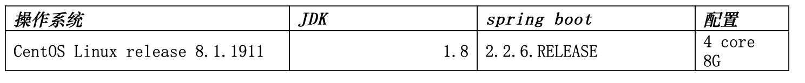
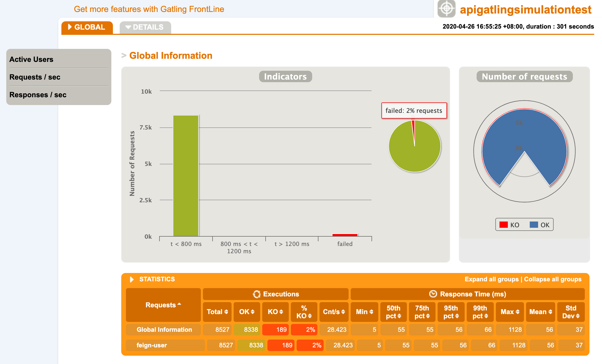
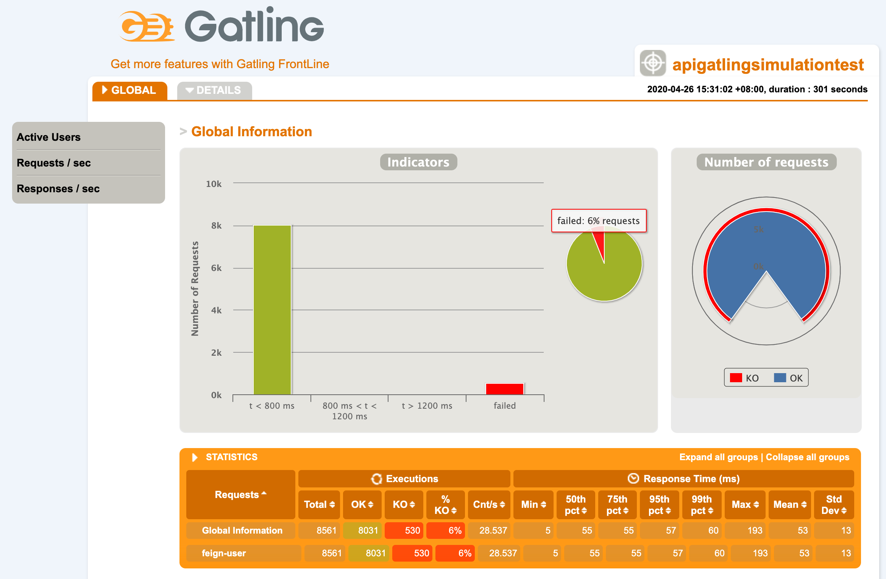
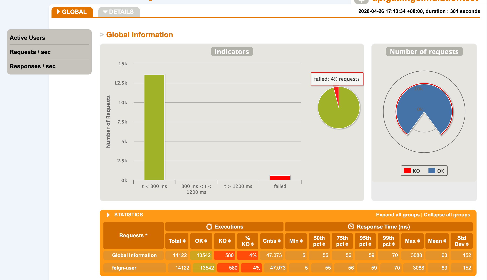
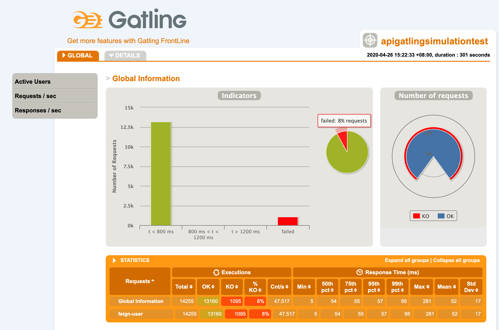
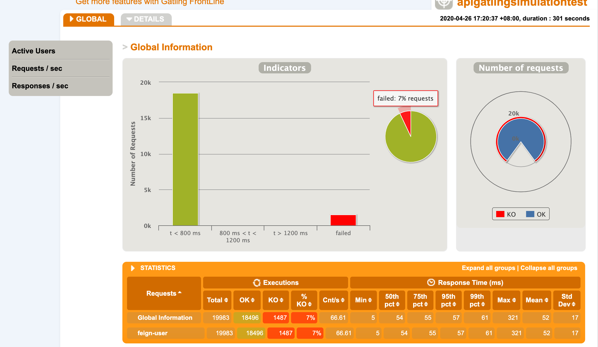
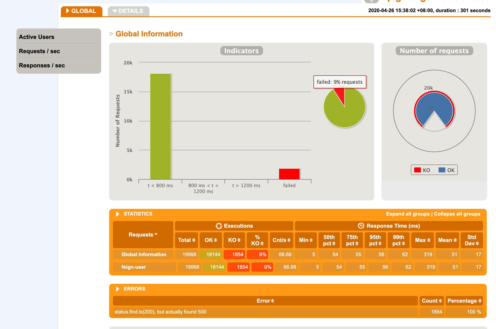
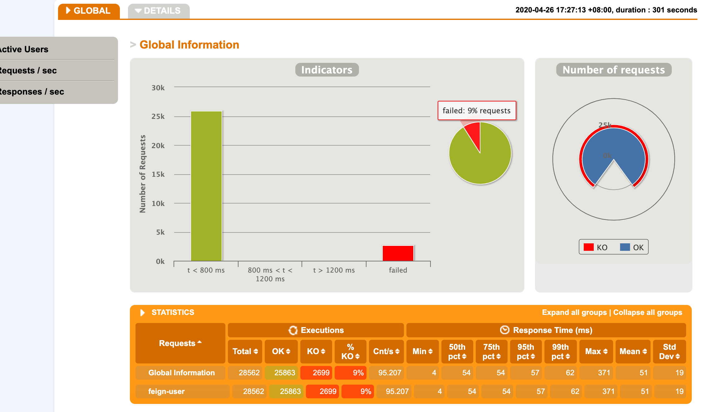
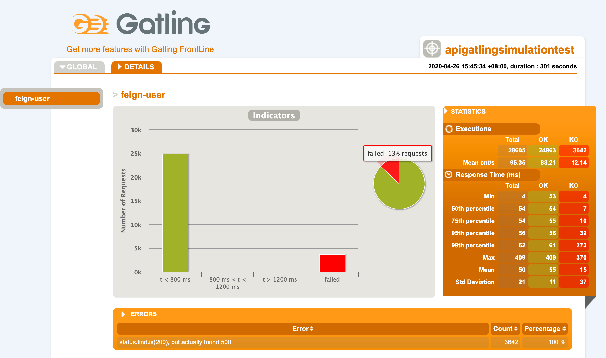

graphql 作为facebook开源的一个API协议，初衷是解决移动端请求次数过多，造成相应慢的技术。
现在已经转化为对rest API的一个补充，可以充当一个数据的网关。把各个微服务的模型和服务在graqhQL中进行一个组装，让数据更加精简，请求更加高效

这里把graphql与spring cloud框架做了一个融合。

原来的服务是使用BIO，而在graphQL中使用reactive-programming的方式来提供服务。

让graphQL做一个服务网关的聚合，对外提供组合API。

同时提供了测试服务，来对tomcat和netty对reative-programing的一个性能测试对比。

部署到三个虚拟机上：
VM1） 数据被调用的服务，是基于BIO，模拟我们现在的已有操作系统，提供user服务（线程sleep50 ms，返回user）
VM2）基于reactive，graphQL的服务器，去调用user 服务
VM3）测试脚本去调用 vm2的服务。

配置信息如下：

并发用户，测试了四组数据，分别对应30，50，70，100个并发用户。

没有做任何优化的情况下，只替换Netty与tomcat的一个测试对比：
  
因为业务简单，就是被调用的线程sleep 50ms，所以响应时间都差不多，但是netty在错误率上要由于tomcat，在并发越大的时候，差距变得更加明显的趋势。

30个用户并发

netty30:

tomcat30:

50个用户并发

netty50:

tomcat50:

70个用户并发

netty70:

tomcat70:

100个用户并发

netty100:

tomcat100:

